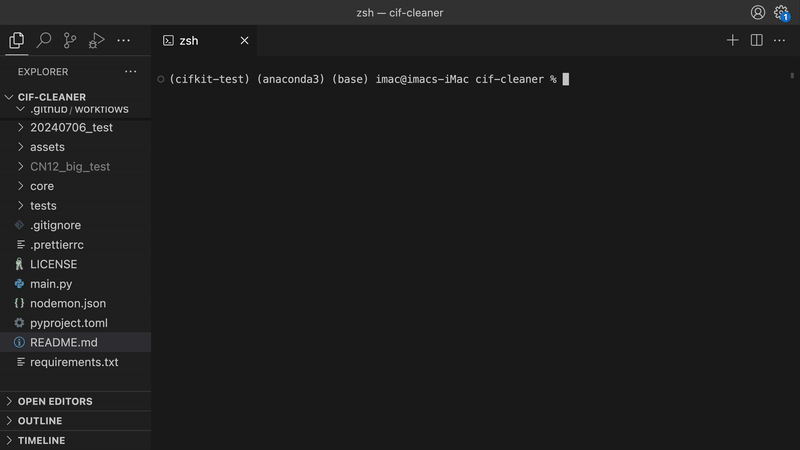
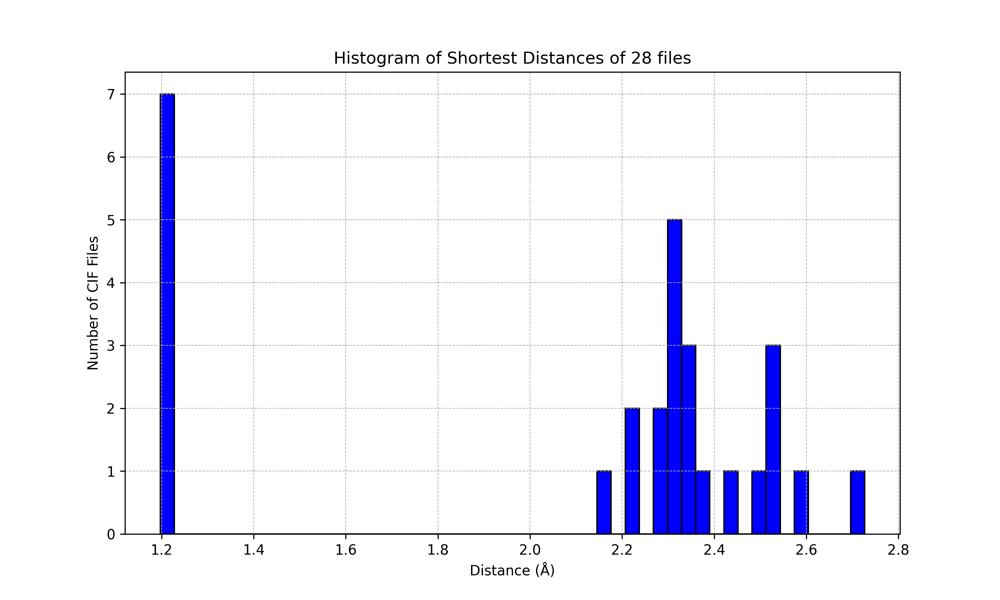
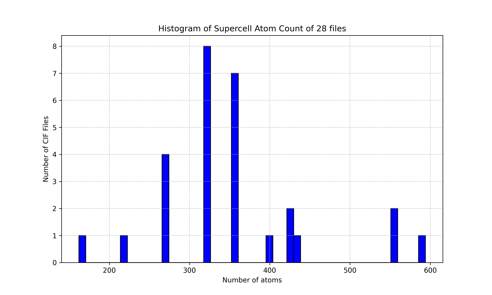

# CIF Cleaner

<!--  -->


[](https://codecov.io/gh/bobleesj/cif-cleaner)
[](https://github.com/bobleesj/cif-cleaner/blob/main/LICENSE)

`CIF Cleaner` is an interactive and codeless program for sorting,
pre-processing, and parsing CIF (Crystallographic Information File) files. It
extracts information from `.cif` files in a folder containing such files.

`CIF Cleaner` is built using the `cifkit` package:
https://github.com/bobleesj/cifkit.

## Motivation

In high-throughput analysis, we extract `.cif` files from databases, sorting
them based on specific attributes. `CIF Cleaner` was developed to streamline
this process by utilizing interactive prompts.

## Demo



## Getting started

Open your terminal or command-line interface:

1. Clone the repository and enter the directory:

```bash
git clone https://github.com/bobleesj/cif-cleaner.git
cd cif-cleaner
```

2. Install dependencies from the requirements.txt file:

```bash
pip install -r requirements.txt
```

Run the program:

```bash
python main.py
```

The program automatically detects folders containing .cif files at the project
level.

```text
Welcome! Please choose an option to proceed:
[1] Move files based on unsupported format after pre-formatting
[2] Move files based on unreasonable distance
[3] Move files based on supercell atom count
[4] Move files based on tags
[5] Move files based on composition type
[6] Move files based on elements
[7] Move files based on coordination number
[8] Copy files based on atomic occupancy and mixing
[9] Get file info in the folder

Enter your choice (1-9): 6
You have chosen: Get file info in the folder

Available folders containing CIF files:
1. elements CIF, 1787 files
2. binary R-X CIF, 3757 files
3. binary R-M CIF, 5510 files
4. binary M-X CIF, 2026 files
5. 20240706_test, 28 files
6. ternary R-M-X CIF, 11418 files

Enter the number corresponding to the folder containing .cif files: 1
```

## **Options**

| Option | Description                                                                     | User input                         |
| ------ | ------------------------------------------------------------------------------- | ---------------------------------- |
| 1      | Standardize and relocate .cif files that do not comply with the expected format | -                                  |
| 2      | Move .cif by minimum distance threshold                                         | Min distance (e.g., 2.0 Å)         |
| 3      | Move .cif by supercell size                                                     | Min and max atom count             |
| 4      | Move .cif by tags                                                               | -                                  |
| 5      | Move .cif by composition type i.g. binary, ternary, etc.                        | -                                  |
| 6      | Move .cif by input elements, matching or containing                             | Elements (e.g., Er Co)             |
| 7      | Move .cif by input coordination numbers, matching or containing                 | Coordination numbers (e.g., 12 16) |
| 8      | Copy .cif by atomic mixing, i.g. full occupancy, atomic mixing, etc.            | -                                  |
| 9      | Get information from .cif files and save .csv                                   | -                                  |

### Option 2: Filter files by minimum distance

For Option [2], the following histogram is saved in the folder. You need to
enter the threshold distance. Any files below this threshold will be moved to a
separate folder.



```text
Enter the threshold distance (unit in Å): 2
```

A folder called `min_dist_below_2.0` is created, and files with the minimum
atomic distance below 2.0 Å are moved.

### Option 3. Filter by supercell size

A supercell is generated by applying a ±1 shift from the unit cell



The program prompts you to enter the minimum and maximum supercell atom count:

```text
Enter the min number of atoms in the supercell: 300
Enter the max number of atoms in the supercell: 500
```

A folder called `supercell_above_300_below_500` will be created with files that
meet the criteria.

### Option 9. Info

A `.csv` is generated containing containing information for each `.cif` file in
the selected folder.

| Filename | Formula                  | Structure         | Tag | Supercell atom count | Site mixing type                 | Composition type | Min distance (Å) | Processing time (s) |
| -------- | ------------------------ | ----------------- | --- | -------------------- | -------------------------------- | ---------------- | ---------------- | ------------------- |
| 300237   | LaPtSb                   | CaIn2             |     | 423                  | full_occupancy_atomic_mixing     | 3                | 2.727            | 0.301               |
| 301710   | YFeSi3                   | Ce(Ni0.59Sb0.41)4 |     | 558                  | full_occupancy_atomic_mixing     | 3                | 2.293            | 0.329               |
| 1955459  | PrNi0.48Si1.48           | AlB2              |     | 267                  | deficiency_atomic_mixing         | 3                | 2.328            | 0.181               |
| 1949113  | Ce2.11Pd1.92In0.89       | Mo2FeB2           |     | 437                  | deficiency_atomic_mixing         | 3                | 2.431            | 0.254               |
| 301188   | Yb0.5Co3Ge3              | Y0.5Co3Ge3        |     | 323                  | deficiency_without_atomic_mixing | 3                | 1.2              | 0.183               |
| 1942974  | Dy0.0011Fe0.8291Ga0.1698 | W                 |     | 162                  | full_occupancy_atomic_mixing     | 3                | 2.514            | 0.032               |
| 1940621  | LuPd0.5Si1.5             | AlB2              |     | 267                  | deficiency_atomic_mixing         | 3                | 2.325            | 0.186               |
| 1200981  | Ni3Sn2                   | Ni3Sn2            | rt  | 594                  | full_occupancy                   | 2                | 2.503            | 0.317               |
| 301180   | Lu0.5Co3Ge3              | Y0.5Co3Ge3        |     | 323                  | deficiency_without_atomic_mixing | 3                | 1.197            | 0.187               |

## Other tools

In addition to `CIF Cleaner`, there are other interactive tools available that
allow you to extract geometric features and visualize bonding patterns from
`.cif` files. I invite you to explore these tools to enhance your analysis:

- Cif Bond Analyzer (CBA): conduct bonding, coordination, and site analysis.
  https://github.com/bobleesj/structure-analyzer-featurizer
- Structure Analysis/Featurizer (SAF): extract ML features for binary and
  ternary compounds. https://github.com/bobleesj/cif-bond-analyzer

## How to contribute

- [](https://github.com/bobleesj/cif-cleaner/stargazers)
  the repository and recommend it to your colleagues who might find this
  repository helpful.
- [](https://github.com/bobleesj/cif-cleaner/network/members)
  the repository and request a pull request for any changes.
- If you have any questions or have any suggestions, feel free to reach out to
  Sangjoon Bob Lee ([@bobleesj](https://github.com/bobleesj)) for any questions.

## Changelog

- 20250124: add option to preprocess files for all all options.
- 20240709: integrate `cifkit` for filtering and moving files.
  (https://github.com/bobleesj/cif-cleaner/issues/24)
- 20240708: add CI tests for all options.
- 20240705: use `cikift`, refactored code and prompts.
